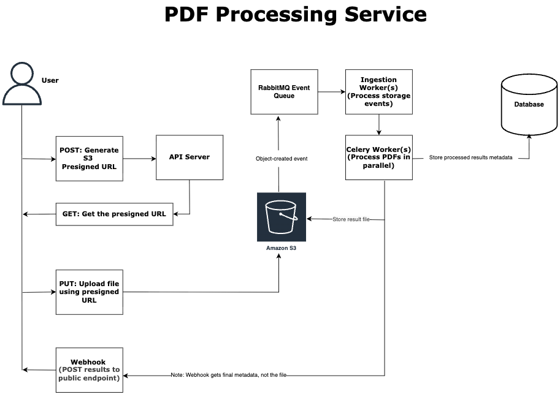

# PDF Processing

High-performance PDF processing service featuring a FastAPI backend, asynchronous Celery workers, and automated ingestion from S3-compatible storage.

## Architecture overview



## Features

- **Asynchronous PDF Processing**: Deep extraction of text, tables, and metadata using `Docling`, `PyMuPDF`, and `OCR` (`easyocr`).
- **Distributed Task Management**: Scalable task processing with **Celery** across multiple priority queues (High, Medium, Low).
- **Web UI & API**: Modern **FastAPI** backend with a server-rendered (Jinja2) Web UI for user login and interactive file uploads.
- **S3-Compatible Storage**: Built-in integration with **MinIO** for managing uploads and processing artifacts using presigned URLs.
- **Event-Driven Ingestion**: Automated background processing triggered by storage events via a dedicated **Storage Worker**.
- **Webhooks**: Integrated **Webhook Server** for delivering real-time processing updates and task completion notifications to external services.
- **Observability**: Real-time metrics via **Prometheus** and distributed tracing with **OpenTelemetry/Jaeger**.
- **Security & Reliability**: JWT authentication, rate limiting (Guest/Free/Pro tiers), and circuit breaker patterns for resilient service communication.

## Table of contents

<!-- TOC -->

- [PDF Processing](#pdf-processing)
  - [Architecture overview](#architecture-overview)
  - [Features](#features)
  - [Table of contents](#table-of-contents)
  - [Technologies used](#technologies-used)
  - [Quick start](#quick-start)
    - [Prerequisites](#prerequisites)
    - [Initial Setup](#initial-setup)
  - [Running the application](#running-the-application)
  - [Configuration](#configuration)
    - [Environment variables](#environment-variables)
  - [Observability & Monitoring](#observability--monitoring)
  - [Scaling Guidelines](#scaling-guidelines)
  - [Make Commands](#make-commands)
  - [Data flow architecture](#data-flow-architecture)
  - [Code style guidelines](#code-style-guidelines)
  - [Repository layout](#repository-layout)

<!-- /TOC -->

## Technologies used

**Backend & API:**

- FastAPI (REST endpoints & Jinja2 UI)
- SQLAlchemy 2.0 (Async) & PostgreSQL
- Pydantic Settings & OmegaConf

**Tasks & Messaging:**

- Celery (Task orchestration)
- RabbitMQ (Message broker)
- Redis (Caching & Rate limiting)

**PDF, OCR & AI:**

- Docling (Document layout & structure)
- EasyOCR (Optical character recognition)
- PyMuPDF (PDF manipulation)

**Observability:**

- OpenTelemetry (Tracing)
- Prometheus (Metrics)
- Jaeger (Trace visualization)

**Dev Tooling:**

- [uv](https://github.com/astral-sh/uv) (Extremely fast Python package manager)
- Docker & Docker Compose
- Ruff (Linting & Formatting)

## Quick start

### Prerequisites

- Docker & Docker Compose
- [uv](https://docs.astral.sh/uv/getting-started/installation/) installed

### Initial Setup

1. **Clone and install dependencies**:

   ```sh
   make install
   ```

2. **Configure environment**:

   ```sh
   cp .env.example .env  # Edit .env with your credentials
   ```

3. **Initialize infrastructure**:

   ```sh
   make setup  # Starts Docker services and initializes databases/MinIO
   ```

## Running the application

To run a fully functional development environment, you should start the following components in separate terminals:

1. **Start all Docker infrastructure**:

   ```sh
   make up
   ```

2. **Run the API (Terminal 1)**:

   ```sh
   make api-run
   # UI: http://localhost:8000
   # API Docs: http://localhost:8000/docs
   ```

3. **Run the PDF Processing Worker (Terminal 2)**:
   This worker handles the main PDF extraction and OCR tasks.

   ```sh
   make worker-run
   ```

4. **Run the Storage Worker (Terminal 3)**:
   Detects new files in MinIO and automatically queues them for ingestion.

   ```sh
   make storage-worker-run
   ```

5. **Run the Webhook Server (Optional - Terminal 4)**:
   Listens for and dispatches notifications to external services.

   ```sh
   uv run webhook_server.py
   ```

## Configuration

The application is configured through:

- `src/config/config.yaml`: Core application settings (file limits, rate limits, UI settings).
- `.env`: Sensitive secrets like DB passwords, MinIO keys, and JWT secrets.

### Environment variables

Copy `.env.example` to `.env` and fill in the required values. Variables are
grouped by service — most defaults work for local development as-is, except:

| Group        | Required to change             | Notes                                              |
|--------------|--------------------------------|----------------------------------------------------|
| Auth         | `API_KEY_SALT`, `SECRET_KEY`   | Generate with `openssl rand -base64 16`            |
| Database     | `POSTGRES_PASSWORD`            | Defaults are fine for local dev only               |
| Redis        | `REDIS_PASSWORD`               | Defaults are fine for local dev only               |
| AWS/MinIO    | `AWS_ACCESS_KEY_ID`, `AWS_SECRET_ACCESS_KEY` | Use MinIO defaults locally        |
| RabbitMQ     | `RABBITMQ_DEFAULT_USER`, `RABBITMQ_DEFAULT_PASS` | Use guest/guest locally       |
| Webhook      | `WEBHOOK_URL`, `WEBHOOK_SECRET_KEY` | Only required if using webhook notifications  |

Everything else can be left as defaults for local development. For production,
also review `DEBUG`, `RELOAD`, `WORKERS`, `CELERY_CONCURRENCY`, and all passwords.

## Observability & Monitoring

The service includes comprehensive monitoring out of the box:

- **Metrics**: Available at `http://localhost:8000/metrics` (Prometheus format).
- **Tracing**: Visualized via Jaeger at `http://localhost:16686` when `make up` is running.
- **Health Checks**: `http://localhost:8000/api/v1/health`.

## Scaling Guidelines

- **PDF worker**: Scale by adding more Celery worker processes. CELERY_CONCURRENCY controls threads/processes per worker. CPU-bound (OCR/extraction) so prefork is correct — roughly 1–2 workers per CPU core is a reasonable starting point.
- **Storage worker**: Single instance handles normal load. Under upload spikes, run multiple instances — the RabbitMQ queue naturally load-balances across consumers with no extra config needed.
- **Chord deadlock risk**: Never run `orchestrate_pdf_processing` and `process_single_chunk` on the same worker pool with limited concurrency — the orchestrator blocks a slot waiting for chunks that can't be picked up.

## Make Commands

**Running Tests:**

```sh
make test
```

**Linting & Formatting:**

```sh
make lint
make format
```

**Docker Compose:**

- `make up` - start the stack
- `make down` - stop the stack
- `make restart` - restart the stack
- `make logs` - view logs
- `make status` - show container status
- `make health-check` - check service health

**App processes:**

- `make api-run` - start FastAPI with Uvicorn
- `make api-run-gunicorn` - start FastAPI with Gunicorn
- `make worker-run` - start the Celery worker
- `make storage-worker-run` - start the storage ingestion worker

Web UI routes:

- `/ui/auth` - login/signup page (stores JWT in browser local storage)
- `/ui/upload` - upload workflow page (one click generates a presigned URL then uploads)

Upload flow:

1. Open `/ui/auth`, sign up or log in.
2. You are redirected to `/ui/upload`.
3. Choose a PDF/TXT/JSON file and click **Upload**.
4. The page calls `POST /api/v1/presigned-urls` and then uploads directly to object storage with the returned URL.
5. Use **Check task status** to query `GET /api/v1/tasks/{task_id}`.

Testing and quality:

- `make test`
- `make test-verbose`
- `make lint`
- `make format`
- `make type-check`

## Data flow (architecture)

High-level pipeline:

1. Client calls the FastAPI service to request uploads or start processing.
2. API writes metadata to PostgreSQL and uses Redis for caching and rate-limiting.
3. Files are stored in MinIO (S3-compatible) and bucket events publish to RabbitMQ.
4. Celery workers consume RabbitMQ events, fetch the file from storage, and run PDF/OCR processing.
5. Results are persisted to PostgreSQL and, if configured, webhook notifications are emitted.
6. Traces and metrics are exported via OpenTelemetry and Prometheus instrumentation.

Key components:

- API: FastAPI app in `src/api/app.py`
- Workers: Celery app and tasks in `src/celery_app` and `src/celery_app/tasks`
- Storage: S3/MinIO integration in `src/services/storage.py`
- Processing: PDF pipeline in `src/services/pdf_processor.py`

## Code style guidelines

- Use Python 3.11+ syntax and type hints throughout the codebase.
- Format and lint with Ruff (`make format`, `make lint`).
- Keep business logic in `src/services` and transport logic in `src/api`.
- Prefer async I/O for network and database operations.
- Add docstrings for public functions and classes; keep them concise.
- Handle errors explicitly with structured exceptions in `src/api/core/exceptions.py`.

## Repository layout

- `src/api` - FastAPI app, routes, and middleware
- `src/celery_app` - Celery configuration and task wiring
- `src/services` - domain services (storage, processing, webhooks)
- `src/db` - database models and repositories
- `docker/` - container init scripts
- `docs/` - operational notes
